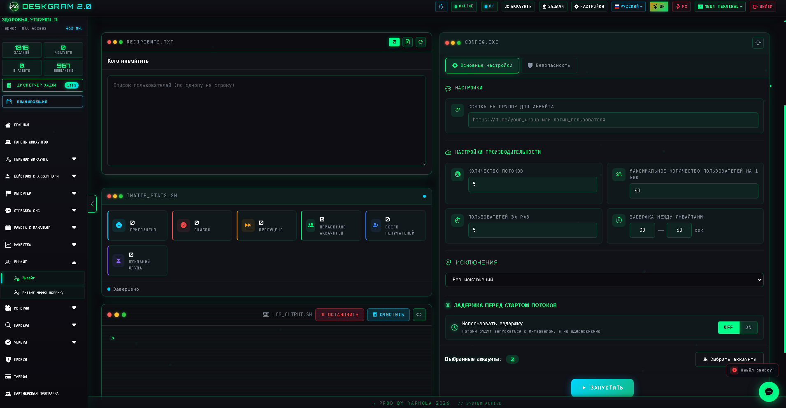
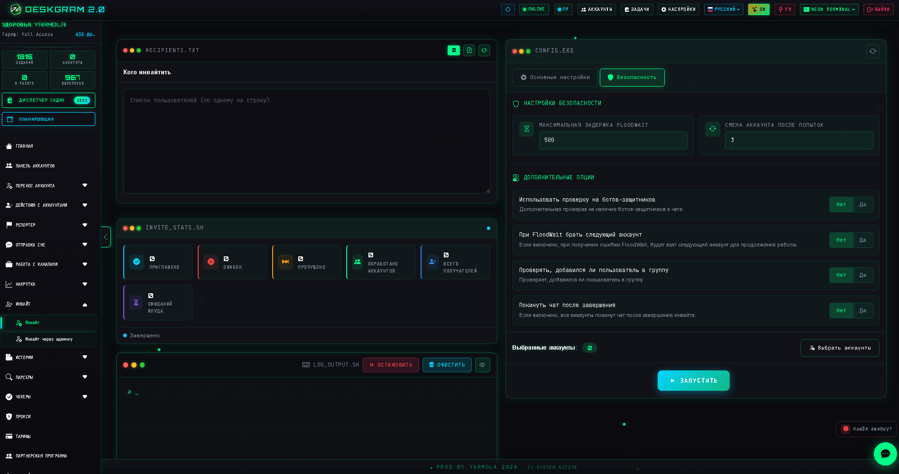

# Инвайт в Telegram через Deskgram 2

`Инвайт` — это модуль Deskgram 2 для массового приглашения пользователей в Telegram-группы и каналы. Он помогает масштабировать работу по готовой базе, контролируя потоки, лимиты, FloodWait, верификацию и безопасность выполнения.

[Главный хаб Deskgram 2](https://github.com/Deskgram-2/deskgram-2-telegram-automation) · [Сайт](https://deskgram2.com/) · [Telegram-бот](https://t.me/DG2welcomebot) · [Web preview](https://deskgram2.com/web-preview)
## Интерактивный Web Preview

Попробовать модуль в браузере: [Открыть веб-превью](https://deskgram2.com/web-preview?path=%2Fapp-demo%2Ffunctions%2Finvite)

## Кратко о модуле

| Параметр | Что внутри |
|---|---|
| Основная задача | Массовое приглашение пользователей в группы и каналы |
| Источник аудитории | Списки получателей, включая базы после сбора аудитории |
| Контроль безопасности | FloodWait, смена аккаунтов, лимиты, верификация |
| Полезен для | Роста групп, каналов и рабочих чатов |
| Связанные модули | Сбор аудитории, Управление прокси, Панель аккаунтов |

## Что умеет модуль

- приглашать пользователей в группы и каналы;
- работать с публичными и приватными сценариями;
- распределять нагрузку между аккаунтами;
- использовать ручные исключения и черный список;
- верифицировать добавление пользователя;
- сохранять статистику и отчеты по итогам работы.

## Быстрый старт

1. Укажите группу или канал для инвайта.
2. Загрузите список получателей.
3. Настройте потоки, лимиты и задержки.
4. Включите нужные защитные параметры.
5. Назначьте аккаунты и запустите задачу.

## Что часто идет до и после инвайта

- [Сбор аудитории](https://github.com/Deskgram-2/telegram-audience-parser-deskgram), если сначала нужно собрать релевантную базу пользователей;
- [Панель аккаунтов](https://github.com/Deskgram-2/telegram-account-manager-deskgram), если требуется подготовить и сгруппировать аккаунты под задачу;
- [Управление прокси](https://github.com/Deskgram-2/telegram-proxy-manager-deskgram), если важна устойчивая инфраструктура под нагрузку;
- [Вступление в группы](https://github.com/Deskgram-2/telegram-join-groups-deskgram), если рядом идут аккаунтные сценарии роста и активности;
- [Диспетчер задач](https://github.com/Deskgram-2/telegram-task-manager-deskgram), если нужно отслеживать запуски, ошибки и общий прогресс.

## Интерфейс модуля

### Главный экран

На основном экране находятся список получателей, статистика, основные настройки и запуск задачи.

### Список получателей

В этот блок загружается база для инвайта: `@username`, `username` или числовые ID.

## Когда особенно полезен

- когда база пользователей уже собрана заранее;
- когда нужно масштабировать приглашения через несколько аккаунтов;
- когда важен контроль FloodWait и понятная статистика;
- когда нужен связанный сценарий от сбора аудитории до инвайта.

## Почему это удобнее ручного инвайта

| Ручной подход | Инвайт через Deskgram 2 |
|---|---|
| Низкая скорость по большой базе | Есть многопоточность и распределение нагрузки |
| Сложно отслеживать FloodWait | Защитные настройки задаются заранее |
| Нет общей статистики | Есть отчеты и встроенная статистика |
| Трудно работать по исключениям | Есть ручные исключения и черный список |
| Процесс плохо масштабируется | Можно работать через сетку аккаунтов |

## Сценарии применения

### Сценарий 1. Рост группы по уже собранной базе

Самый понятный сценарий: сначала вы собираете аудиторию, затем запускаете инвайт по очищенной базе. В таком виде модуль работает как growth-инструмент, а не как случайный ручной invite.

### Сценарий 2. Инвайт после прогрева и подготовки среды

Если аккаунты сначала проходят через [массовые подписки](https://github.com/Deskgram-2/telegram-join-groups-deskgram) или [прогрев аккаунтов](https://github.com/Deskgram-2/telegram-account-warmup-deskgram), invite становится следующим более активным этапом.

### Сценарий 3. Двухшаговая коммуникация

Иногда эффективнее сначала написать пользователю в личку, а уже потом приглашать его в группу. В такой схеме invite лучше работает в паре с [рассылкой в ЛС](https://github.com/Deskgram-2/telegram-direct-messaging-deskgram), а не в отрыве от нее.

## Что выбрать: инвайт или рассылку в ЛС

| Если задача такая | Лучше использовать |
|---|---|
| Нужно сразу расти по участникам в группе или канале | [Инвайт](https://github.com/Deskgram-2/telegram-invite-tool-deskgram) |
| Нужен личный прогрев до входа в сообщество | [Рассылка в ЛС](https://github.com/Deskgram-2/telegram-direct-messaging-deskgram) |
| Нужен более безопасный двухшаговый сценарий | ЛС -> инвайт |
| База еще не готова | Сначала [сбор аудитории](https://github.com/Deskgram-2/telegram-audience-parser-deskgram), потом инвайт |

## Что выбрать: инвайт или массовые подписки

| Если задача такая | Лучше использовать |
|---|---|
| Нужно добавить внешних пользователей в группу или канал | [Инвайт](https://github.com/Deskgram-2/telegram-invite-tool-deskgram) |
| Нужно сначала подключить свои аккаунты к нужной среде | [Массовые подписки](https://github.com/Deskgram-2/telegram-join-groups-deskgram) |
| Нужен growth-сценарий в два этапа | Сначала подписки, затем инвайт |
| Нужно подготовить среду, но не трогать внешнюю аудиторию | Массовые подписки |

## FAQ для рабочих сценариев

### Когда лучше сначала прогреть или подписать аккаунты, а не сразу запускать инвайт?

Когда сетка аккаунтов новая, среда еще не подготовлена или впереди более длинный growth-маршрут. В таком случае полезно пройти через [прогрев аккаунтов](https://github.com/Deskgram-2/telegram-account-warmup-deskgram) или [массовые подписки](https://github.com/Deskgram-2/telegram-join-groups-deskgram), а уже потом переходить к invite.

### Когда инвайт лучше работает как второй шаг после личного сообщения?

Когда важно сначала дать пользователю контекст, прогреть интерес или перевести холодную базу в более теплую. Тогда связка [рассылка в ЛС](https://github.com/Deskgram-2/telegram-direct-messaging-deskgram) -> инвайт обычно выглядит аккуратнее, чем прямой рост без предварительного касания.

### От чего чаще всего зависит качество invite-сценария?

От качества базы, состояния аккаунтов, лимитов, инфраструктуры и того, насколько логично invite встроен в общую цепочку, а не запущен изолированно.

## Смежные репозитории

- [Главный хаб Deskgram 2](https://github.com/Deskgram-2/deskgram-2-telegram-automation)
- [Сбор аудитории](https://github.com/Deskgram-2/telegram-audience-parser-deskgram)
- [Управление прокси](https://github.com/Deskgram-2/telegram-proxy-manager-deskgram)
- [Панель аккаунтов](https://github.com/Deskgram-2/telegram-account-manager-deskgram)
- [Вступление в группы](https://github.com/Deskgram-2/telegram-join-groups-deskgram)
- [Диспетчер задач](https://github.com/Deskgram-2/telegram-task-manager-deskgram)

## FAQ

### Какие форматы получателей поддерживаются?

Обычно используются `@username`, `username` и числовые ID.

### Что делать при FloodWait?

Нужно аккуратно выставлять лимиты, задержки и при необходимости включать переключение на следующий аккаунт.

### Нужна ли верификация добавления?

Не всегда, но она полезна, когда нужна более точная картина по фактическим инвайтам.

### Откуда лучше брать базу?

Самый естественный путь — использовать базу после сбора аудитории.

## Полезные ссылки

- [Главный хаб Deskgram 2](https://github.com/Deskgram-2/deskgram-2-telegram-automation)
- [Сайт Deskgram 2](https://deskgram2.com/)
- [Telegram-бот Deskgram 2](https://t.me/DG2welcomebot)
- [Web preview](https://deskgram2.com/web-preview)
